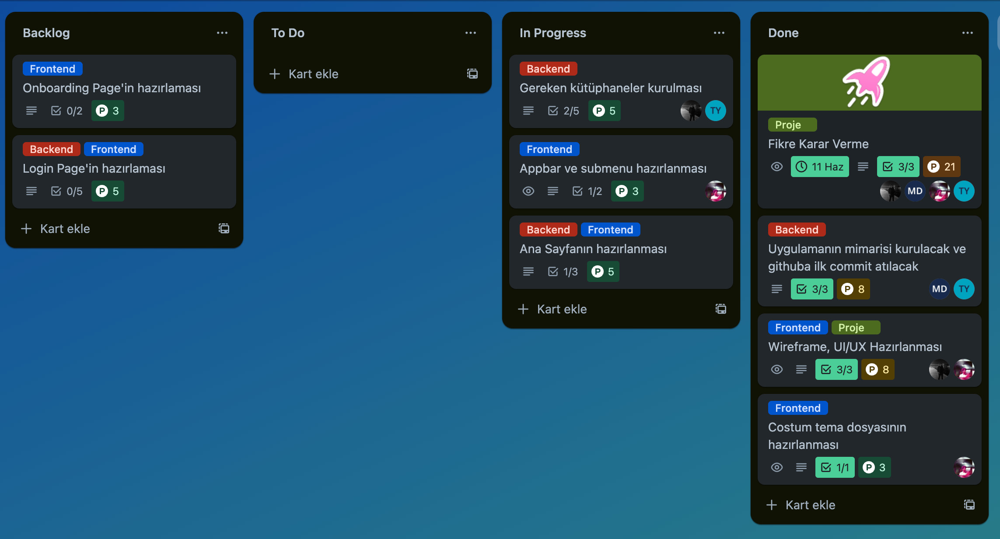
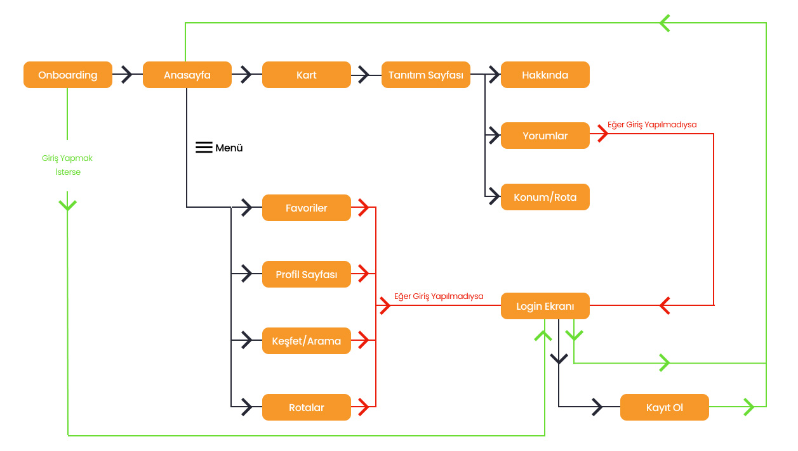
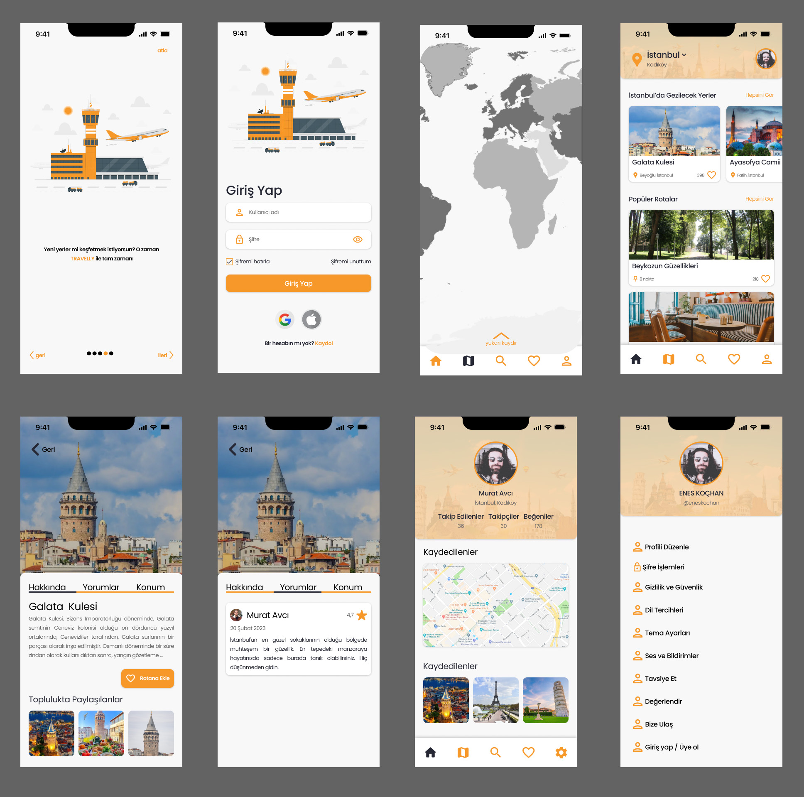

# **Takım İsmi**

Takım Flutter 46

# Ürün İle İlgili Bilgiler

## Takım Elemanları
- Murat Avcı: Scrum Master / Developer
- Enes Koçhan: Product Owner / Developer
- Tuğba Yıldız: Developer
- Mert Ali Dalkır: Developer
- Emine Ünal: Aktif olmayan üye

## Ürün İsmi

###  Travelly 

## Product Backlog URL

[Flutter Team 46 Trello Backlog Board](https://trello.com/invite/b/LYhHZu5h/ATTI2a04919fec9f132a7fae05afcfe79dca39429EA2/sprint-1)

## Ürün Açıklaması

Gezginleri hedef kitlesi olarak odak alan uygulamamız, seyahat edenlerin deneyimlerini zenginleştirmek için tasarlandı.  Travelly  sayesinde, turist olarak ziyaret ettiğiniz şehirlerde gezilmesi önerilen yerleri keşfedebilir, topluluk tarafından oluşturulan rotaları kolaylıkla inceleyebilir ve şehrin geleneksel yemeklerini deneyimleyebilirsiniz. Ayrıca, sevdiğiniz gezginlerin hesaplarını takip edebilir ve daha önce kullanmış oldukları rotaları görüntüleyerek ilham alabilirsiniz. Uygulama içindeki kullanıcı dostu arayüzü sayesinde, seyahat deneyimlerinizi daha keyifli hale getirecek birçok özelliğe erişim sağlayacaksınız.

Uygulamanın ikincil fonksiyonu, kullanıcıların gidilen her mekanı, müzeyi veya diğer yerleri yorumlayıp puanlamasını sağlamaktır. Bu sayede, diğer gezginlerin gerçek deneyimlerini gözlemleyerek daha bilinçli kararlar alabilirsiniz. Gelişmiş yapay zeka algoritmalarıyla donatılmış uygulamamız, gezilmesi önerilen yerleri tek bir tuşla sıralayarak sınırlı zamanınızda bile görülmesi gereken her yeri keşfetmenizi sağlayacaktır. Size en uygun rotaları belirleyerek, seyahat deneyiminizin en iyi şekilde geçmesini sağlamak için sürekli olarak size rehberlik edecektir.

Uygulama, seyahat etmeyi sevenlerin yolculuklarını unutulmaz kılmak için tasarlanmıştır.

## Ürün Özellikleri

- Topluluk kullanıcıları tarafından rota oluşturulması.
- Topluluk kullanıcıları tarafından veya   Travelly  tarafından oluşturulan rotaların ve konumların favorilere eklenmesi ve bunlar hakkında yorum yapılması.
- Rotaların veya konumların filtrelenmesi.
- Daha önce gidilen ülkelerin, şehirlerin veya konumların kaydedilmesi ve bunların harita üzerinde görüntülenmesi.

## Hedef Kitle

- Gezginler
- Turistler
- Gezi yazarları
- Seyahat endüstrisi

---

# Sprint 1

- **Sprint Notları**: Story'ler backlogların içinde yazılmış ve story'e bağlı taskler story kartının içine eklenmiştir. Daily Scrum notları exel dosyasıyla paylaşılmıştır.

- **Sprint içinde tamamlanması tahmin edilen puan**: 43 Puan

- **Puan tamamlama mantığı**: Puanlama yapılırken her bir story için “Ne kadar sürede bitirirsin?”, “Zorluk seviyesi nedir?” sorularının cevapları her ekip üyesinden alındı ve ortalama hesaplanıp hikayelere puan verildi.   İlk sprint boyunca 61 puanlık backlog hazırlandı, 43 puanlık kısmını ilk sprintte bitirme kararı alındı. 

- **Backlog düzeni ve Story seçimleri**: Backloglar başlangıçta yapılacak story'lere göre hazırlandı. Sprint başına tahmin edilen puan sayısını geçmeyecek şekilde sırayla backlog'lar seçildi. Story'ler backloglara yazılırken etiketler verilmiş mavi etiketler "Frontend", kırmızı etiketler "Backend" ler için kullanılmıştır.  Her storyde yapılacak işler yazılmış ve gerekli linkler eklenmiştir. Ayrıca yapılacak işler (task'ler) kontrol listesi altına eklenmiştir. 

- **Daily Scrum**: Daily scrum toplantıları Discord üzerinde oluşturduğumuz sunucu üzerinden sesli olarak yapıldı. Toplantılar boyunca alınan notlar google çevirimci e-tablolarda paylaşıldı.
  [Daily Scrum Notları](https://docs.google.com/spreadsheets/d/155HReb46n69204VOSWxT96abclGTPvVfpnWJdaWamCo/edit?usp=sharing) 

- **Sprint board update**: Sprint board screenshotları: 
 

- **Ürün Durumu**: Ürünün Workflow v UI screenshotları:
  
  
  
- **Sprint Review**: 
Alınan kararlar: Uygulamanın tasarımının genel hatları kesinleşmiş, google_maps ve firebase kütüphaneleri kurulmuş, veritabanı için firebase servisleri aktif edilmiş ve eksiklikler değerlendirilmiştir.   Sprint Review katılımcıları: Murat Avcı, Enes Koçhan, Mert Ali Dalkır, Tuğba Yıldız

- **Sprint Retrospective:**
  - Görev dağılımlarında ufak değişiklikler olmuştur.
  - Takımın gelecek sprintlerde daha aktif olması gerektiği konuşulmuştur.

---

## Product Backlog URL

[Flutter Team 46 Trello Backlog Board](https://trello.com/invite/b/LYhHZu5h/ATTI2a04919fec9f132a7fae05afcfe79dca39429EA2/sprint-1)

---

# Sprint 2

- **Sprint Notları**: Sprint ortasına denk gelen uzun bayram tatili sebebiyle sprint süreci boyunca az toplantı yapımış ve bazı aksaklıklar meydana gelmiştir.

- **Sprint içinde tamamlanması tahmin edilen puan**: 42 Puan

-  **Daily Scrum**: Daily scrum toplantıları Discord üzerinde oluşturduğumuz sunucu üzerinden sesli olarak yapıldı. Toplantılar boyunca alınan notlar google çevirimci e-tablolarda paylaşıldı.
  [Daily Scrum Notları](https://docs.google.com/spreadsheets/d/155HReb46n69204VOSWxT96abclGTPvVfpnWJdaWamCo/edit?usp=sharing) 

- **Sprint board update**: Sprint board screenshotları: 

- **Ürün Durumu**: Ürün Durumu:
  
  
  
- **Sprint Review**: 
Alınan kararlar: Uygulamanın giriş ekranları hazırlanmış, diğer önemli sayfaların büyük bölümü hazırlanmış ve Firebase'den veriler canlı olarak çekilmiştir.    Sprint Review katılımcıları: Murat Avcı, Enes Koçhan, Mert Ali Dalkır, Tuğba Yıldız

- **Sprint Retrospective:**
  - Görev dağılımlarında ufak değişiklikler olmuştur.
  - Katılım sağlamayamadığımız süreçler için bilgilendirmelerin yapılması konusu üzerinde durulmuştur.
  - Hedeflenen puanın biraz gerisinde kaldığımız için diğer sprintte buna dikkat etmemiz gerektiği konuşulmuştur.
